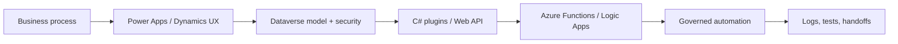

  

  
  
  

  

## What I Build

I build governed automation systems across **Power Platform**, **Azure**, **Dataverse**, **C#/.NET**, APIs, and AI-assisted engineering workflows.

The through line in my work is replacing manual operational bottlenecks with observable, maintainable systems: approval workflows, invoice automation, Dataverse plugins, custom connectors, pro-code extensions, and internal tooling that business teams can actually operate.

  
  
  
  
  
  
  
  

## Resume-backed Signals

| Signal | Evidence |
| --- | --- |
| **4+ years** | Enterprise automation and Microsoft cloud integration delivery |
| **95% faster workflows** | Custom Dataverse Web API + C# plugin path replacing slow connector execution |
| **60% less click depth** | Modernized Dynamics 365 approval flows with Canvas Apps and JavaScript actions |
| **PL-200 certified** | [Microsoft Power Platform Functional Consultant credential](https://learn.microsoft.com/en-us/users/merburakdal-1246/credentials/ebde4afa39a5ceff) |

## Operating Stack

  
  
  
  
  

  

## Selected Systems

| System | What it shows | Link |
| --- | --- | --- |
| **Agent Rules Control Plane** | Local-first dashboard for inspecting and editing rules, skills, and generated instructions across Codex, Claude Code, Gemini CLI, and OpenCode. | [agent-rules-hub](https://github.com/obdagli/agent-rules-hub) |
| **Entra Sync Plugin** | C# / .NET integration patterns around Microsoft identity and Dataverse administration. | [entra-sync-plugin](https://github.com/obdagli/entra-sync-plugin) |
| **Asset Compressor** | Python CLI utility for automated web asset optimization and deployment payload reduction. | [asset-compressor](https://github.com/obdagli/asset-compressor) |
| **Groq STT** | Push-to-talk speech-to-text workflow using Groq Whisper models across Linux and Windows. | [groq-stt](https://github.com/obdagli/groq-stt) |

## How I Work

- Model the source of truth before patching symptoms.
- Treat AI tools as engineering infrastructure: rules, memory, browser checks, prompt systems, and validation loops are explicit.
- Keep private enterprise details private while still showing sanitized architecture and public-safe evidence.
- Prefer maintainable automation over one-off scripts that only fix the latest bottleneck.

## Public GitHub Snapshot

  

  

  

